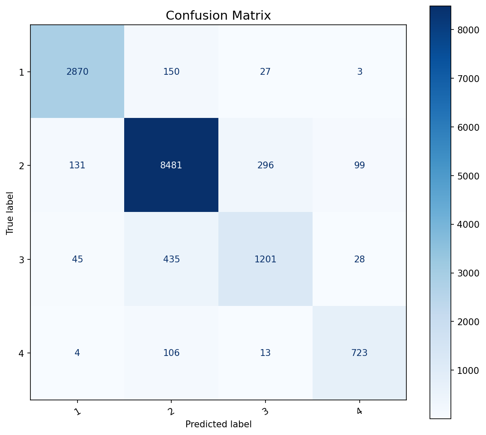
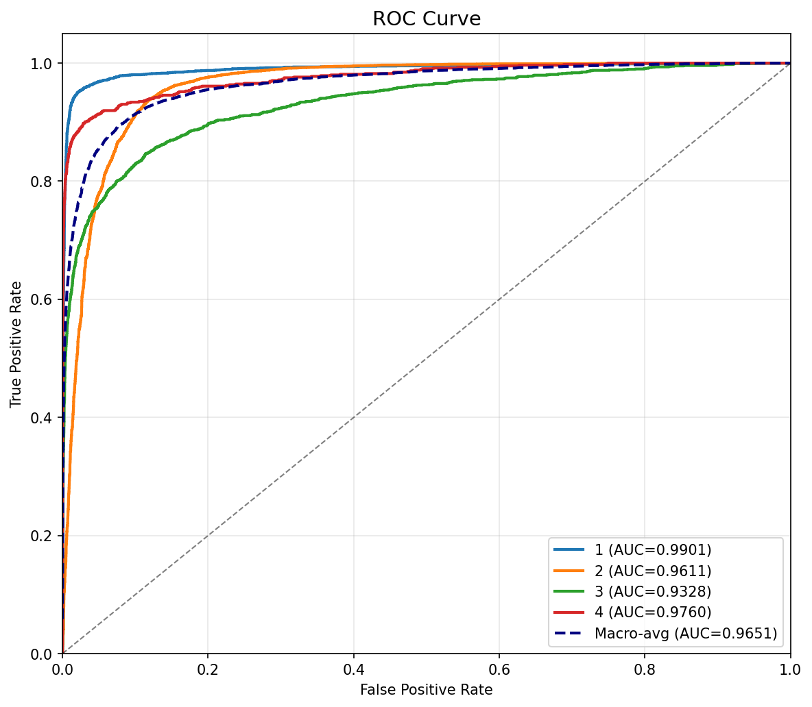
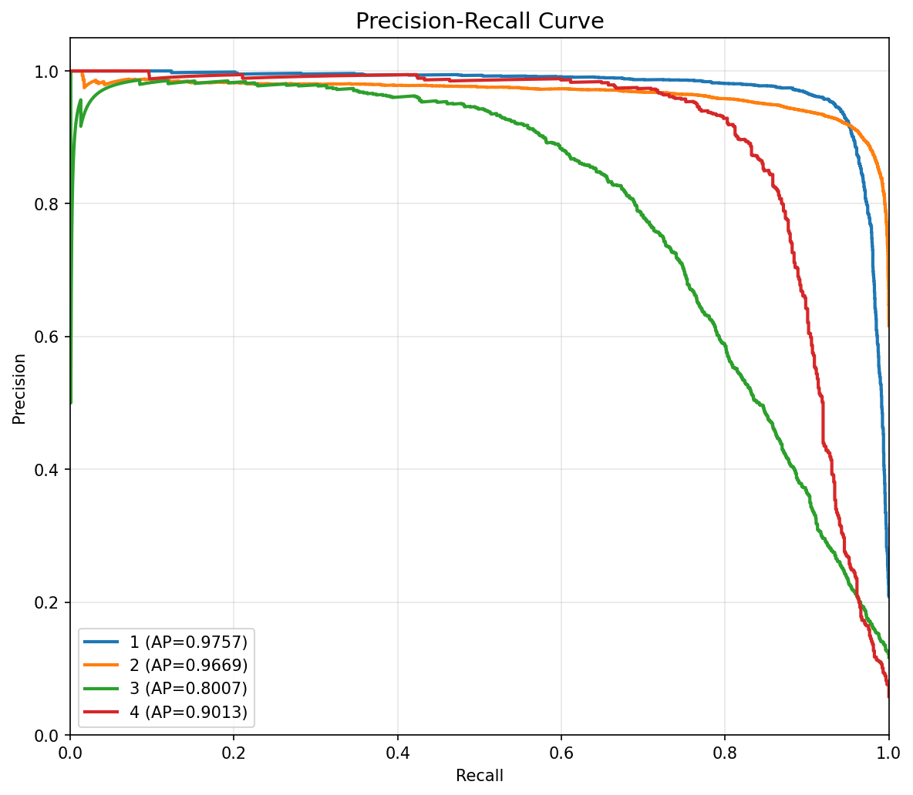
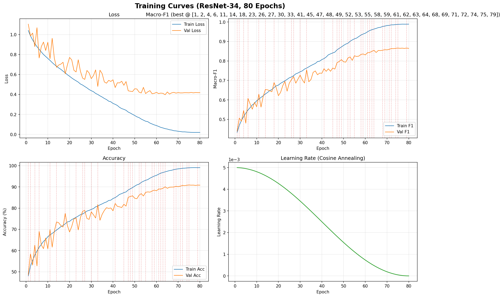
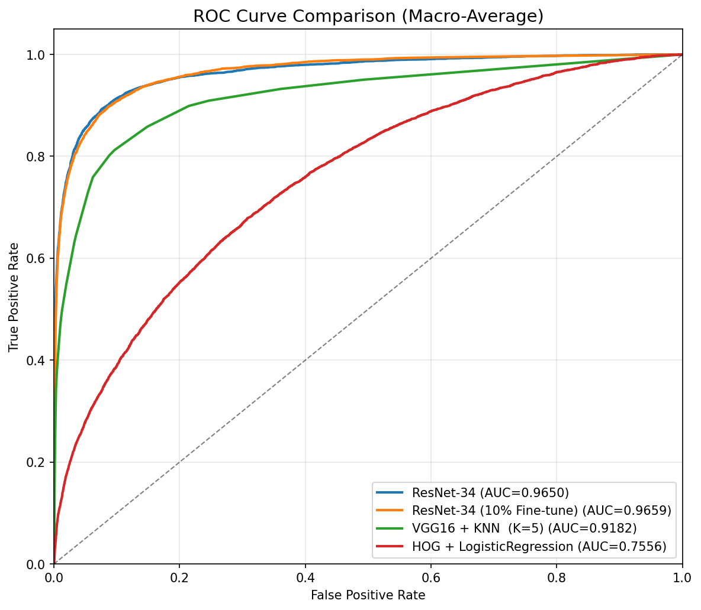
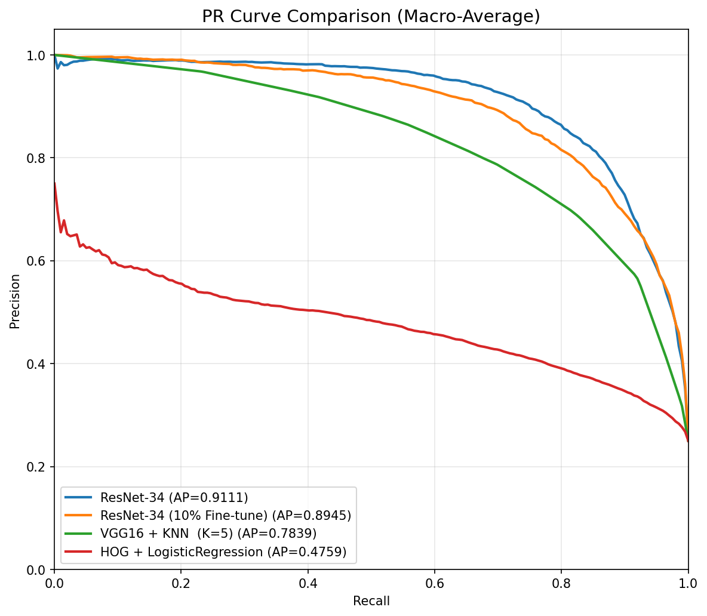
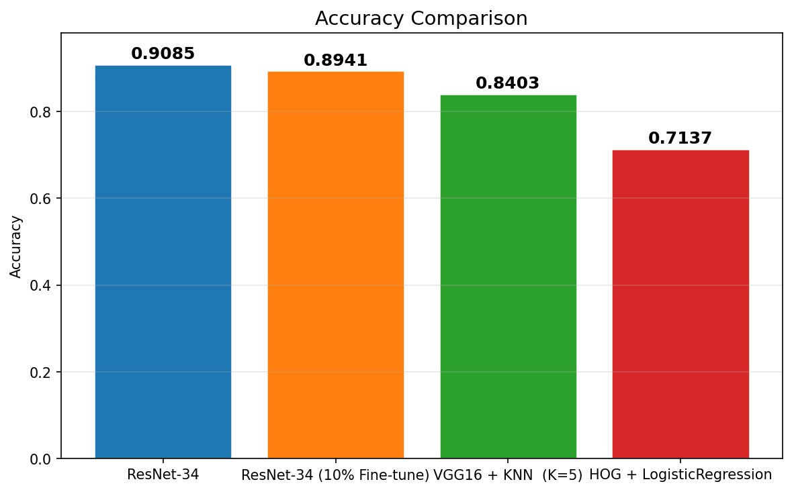

# trash-division

一个基于卷积神经网络的垃圾分类识别系统

> 同济大学 Python 人工智能程序设计课程小组作业

基于 ResNet-34 架构的 CNN 模型（约 21M 参数），将生活垃圾分为厨余垃圾、可回收物、其他垃圾、有害垃圾四个类别，输入为 256×256 RGB 图像。

---

## 目录

- [项目特点](#项目特点)
- [模型架构](#模型架构)
- [数据集](#数据集)
- [环境要求](#环境要求)
- [快速开始](#快速开始)
- [文件说明](#文件说明)
- [目录结构](#目录结构)
- [训练细节](#训练细节)
- [评估与可视化](#评估与可视化)
- [许可证](#许可证)

---

## 项目特点

- **四类垃圾分类**：厨余垃圾（1）、可回收物（2）、其他垃圾（3）、有害垃圾（4）
- **ResNet-34 架构**：约 21M 参数，34 层深度残差网络，含 Dropout 正则化
- **数据增强**：训练时使用随机裁剪、水平翻转、旋转、色彩抖动
- **Macro-F1 评估**：采用宏平均 F1 分数作为主要评估指标，兼顾各类别表现
- **类别加权损失**：自动计算类别权重，缓解类别不平衡问题
- **余弦退火学习率调度**：使用 CosineAnnealingLR 平滑调整学习率
- **断点续训**：自动检测 `best_model.pth` 并加载继续训练
- **多设备支持**：自动选择 CUDA > Intel XPU > CPU

## 模型架构

模型基于标准 ResNet-34 架构，使用 BasicBlock 构建。

### BasicBlock 块

每个 BasicBlock 包含两个 3x3 卷积层 + 跳跃连接：

| 层 | 卷积 | 作用 |
|---|---|---|
| 3x3 Conv | 特征提取 | 第一层卷积 |
| 3x3 Conv | 特征提取 | 第二层卷积 |

### 网络结构

| 阶段 | 块数 | 输出通道数 | 说明 |
|---|---|---|---|
| 初始层 | - | 64 | 7x7 Conv, stride=2 + MaxPool |
| Layer1 | 3 | 64 | 第一个残差阶段 |
| Layer2 | 4 | 128 | - |
| Layer3 | 6 | 256 | - |
| Layer4 | 3 | 512 | 最终残差阶段 |
| 分类头 | - | 4 | 全局平均池化 + Dropout + 全连接层 |

## 数据集

本项目使用 [tany0699/garbage265](https://modelscope.cn/datasets/tany0699/garbage265) 中文生活垃圾分类数据集，包含 265 个子类别的生活垃圾图片。

通过 `Merge_classes.py` 脚本将 265 个子类别合并为 4 个顶级类别：

```
厨余垃圾 -> 1
可回收物 -> 2
其他垃圾 -> 3
有害垃圾 -> 4
```

数据集预期放置在 `../trash_division_data/`（与项目根目录平级的兄弟目录）。

## 环境要求

本项目无 `requirements.txt`，需手动安装以下依赖：

- Python 3.8+
- PyTorch（推荐 1.10+）
- torchvision
- tqdm
- matplotlib
- pandas
- Pillow
- torchsummary
- scikit-learn（仅 `Evaluate.py` 需要）
- scikit-image（仅 `baseline/HOG_Baseline.py` 需要）

## 快速开始

1. **数据预处理**：将 265 个子类别合并为 4 个顶级类别

   ```bash
   python Merge_classes.py
   ```

2. **训练模型**：

   ```bash
   python Train.py
   ```

3. **微调模型**（可选，冻结浅层、微调深层）：

   ```bash
   python Finetune.py
   ```

4. **评估与可视化**：

   ```bash
   python Evaluate.py                  # 混淆矩阵、ROC 曲线、PR 曲线
   python Curve.py                     # 训练过程的 loss/f1/acc/lr 曲线
   python baseline/compare_models.py   # 多模型基线对比（ROC/PR/准确率）
   ```

> **注意**：
> - 数据目录默认为 `../trash_division_data/ultimate_4_class/`，需先运行合并脚本
> - Windows 系统需将 `num_workers` 设为 `0`（参见 `Dataloader.py` 和 `Train.py`）
> - 训练会自动从 `best_model.pth` 断点续训（若存在）

## 文件说明

| 文件 | 功能 |
|---|---|
| `Train.py` | 训练主脚本，包含训练循环、验证、评估 |
| `Finetune.py` | 微调脚本，冻结浅层后微调深层网络 |
| `Dataloader.py` | 数据加载模块，包含 RobustImageFolder 和 DataLoader 创建 |
| `Model.py` | 模型定义，ResNet-34（BasicBlock）+ Dropout |
| `Merge_classes.py` | 数据集预处理，265 类合并为 4 类 |
| `Evaluate.py` | 模型评估，绘制混淆矩阵、ROC 曲线、PR 曲线 |
| `Curve.py` | 训练曲线绘制，从 CSV 读取并绘制 loss/f1/acc/lr 曲线 |
| `baseline/VGG_KNN.py` | VGG16 预训练特征提取 + KNN 四分类基线 |
| `baseline/ResNet34_Pretrained_10pct.py` | ResNet-34 ImageNet 预训练 + 10% 数据微调 |
| `baseline/HOG_Baseline.py` | HOG + 颜色直方图 + LogisticRegression（纯传统 CV） |
| `baseline/compare_models.py` | 多模型对比（ROC / PR 曲线 + 准确率柱状图） |
| `training_log.csv` | 训练日志，记录每轮 epoch 的 loss、f1、acc、lr |
| `best_model.pth` | 训练好的最佳模型权重（约 125 MB，不纳入版本控制） |
| `AGENTS.md` | AI 助手指南（开发辅助） |
| `THIRD_PARTY_LICENSES.md` | 第三方数据集许可证声明 |

## 目录结构

```
trash-division/
├── AGENTS.md               # AI 助手指南
├── baseline/                # 基线模型目录
│   ├── VGG_KNN.py           # VGG16 + KNN 分类脚本
│   ├── ResNet34_Pretrained_10pct.py  # ResNet-34 ImageNet 预训练 + 10% 微调
│   ├── HOG_Baseline.py      # HOG + LogisticRegression 纯传统基线
│   ├── compare_models.py    # 多模型对比脚本
│   ├── roc_comparison.png   # 多模型 ROC 对比（compare_models.py 输出）
│   ├── pr_comparison.png    # 多模型 PR 对比（compare_models.py 输出）
│   └── accuracy_bar.png     # 多模型准确率对比（compare_models.py 输出）
├── best_model.pth           # 最佳模型权重（不纳入版本控制）
├── Curve.py                 # 训练曲线绘制脚本
├── Dataloader.py            # 数据加载模块
├── Evaluate.py              # 模型评估可视化脚本
├── Finetune.py              # 微调脚本
├── .gitattributes           # Git 属性配置
├── LICENSE                  # MIT 许可证
├── Merge_classes.py         # 数据集预处理脚本
├── Model.py                 # 模型定义
├── README.md                # 项目说明（本文件）
├── THIRD_PARTY_LICENSES.md  # 第三方许可证声明
├── Train.py                 # 训练主脚本
├── training_log.csv         # 训练日志
├── confusion_matrix.png     # 混淆矩阵（Evaluate.py 输出）
├── roc_curve.png            # ROC 曲线（Evaluate.py 输出）
├── pr_curve.png             # PR 曲线（Evaluate.py 输出）
└── training_curves.png      # 训练曲线（Curve.py 输出）
```

## 训练细节

| 配置项 | 说明 |
|---|---|
| 输入尺寸 | 256 x 256 RGB |
| 优化器 | SGD（momentum=0.9, weight_decay=1e-4） |
| 初始学习率 | 0.001 |
| 学习率调度 | CosineAnnealingLR |
| 损失函数 | 类别加权 CrossEntropyLoss |
| 评估指标 | Macro-F1（宏平均 F1 分数） |
| 批量大小 | 默认 16（可通过参数调整） |
| 训练轮数 | 默认 20（可通过参数调整） |
| 设备选择优先级 | CUDA > Intel XPU > CPU |
| 断点续训 | 自动检测 best_model.pth 并加载 |

训练时数据增强管线：RandomResizedCrop(256, scale=(0.8, 1.0)) + RandomHorizontalFlip(p=0.5) + RandomRotation(+-15 deg) + ColorJitter(brightness=0.2, contrast=0.2, saturation=0.2)

## 评估与可视化

训练完成后，`training_log.csv` 会记录每个 epoch 的训练/验证指标。以下两个脚本用于可视化分析：

### Evaluate.py — 模型评估

在验证集上推理，生成三张评估图表：

```bash
python Evaluate.py
```

脚本顶部的 `MODEL_PATH`、`DATA_ROOT`、`BATCH_SIZE`、`NUM_WORKERS` 可按需修改。

**混淆矩阵**



**ROC 曲线**



**PR 曲线**



### Curve.py — 训练曲线

从 `training_log.csv` 读取训练日志，绘制四张子图：

```bash
python Curve.py
```



### 基线模型对比

`compare_models.py` 对所有模型在验证集上统一评估，生成三张对比图表：

```bash
python baseline/compare_models.py
```

对比阵容：ResNet-34、ResNet-34 (10% Fine-tune)、VGG16 + KNN、HOG + LogisticRegression。

**ROC 曲线对比**



**PR 曲线对比**



**准确率柱状图**



## 许可证

本项目主代码采用 [MIT 许可证](LICENSE)。

本项目包含的数据集 `tany0699/garbage265` 采用 [Apache License 2.0](THIRD_PARTY_LICENSES.md)，详情请参阅 `THIRD_PARTY_LICENSES.md` 文件。
